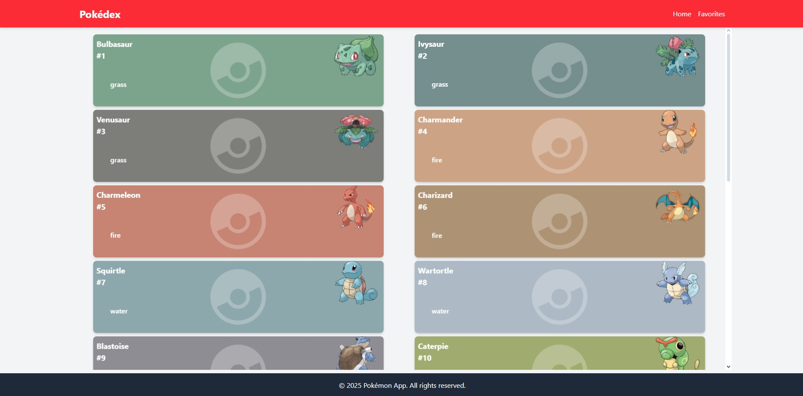

# Pokédex App

The **Pokédex App** is a modern and responsive Pokémon browser built with **React, TypeScript, Tailwind CSS, and React Query**. It allows users to explore Pokémon data with infinite scrolling, view detailed stats, add favorites, and navigate smoothly through an intuitive interface.

## 🚀 Features

- 🔄 **Infinite Scrolling**: Seamless browsing of Pokémon data.
- ⭐ **Favorites System**: Mark your favorite Pokémon.
- 📊 **Detailed Pokémon Pages**: View types, stats, and abilities.
- ⚡ **Optimized Data Fetching**: Uses React Query for efficient API calls.
- 📱 **Responsive Design**: Works across all devices.

## 🛠️ Technologies Used

- **React** - Frontend framework
- **TypeScript** - Type safety
- **Tailwind CSS** - Styling
- **React Query** - Data fetching and caching
- **React Router** - Navigation

## 📸 Screenshots

  # Si está en src/assets

## 🔧 Installation & Setup

1. **Clone the repository:**
   ```sh
   git clone https://github.com/yourusername/pokedex-app.git
   cd pokedex-app
   ```

2. **Install dependencies:**
   ```sh
   npm install
   ```

3. **Start the development server:**
   ```sh
   npm run dev
   ```

4. **Open in the browser:**
   Visit `http://localhost:5173` (if using Vite) or the provided local URL.

## 📂 Project Structure
```
/pokedex-app
│── src/
│   ├── actions/           # Data fetching with React Query
│   │    ├── pokemons/
│   │       ├── get-pokemon-by-id.ts
│   │       ├── get-pokemons-by-ids.ts
│   │       ├── get-pokemons-names-with-id.ts
│   │       ├── get-pokemons-names-with-id.ts
│   │       └── index.ts
├── assets/      # Static assets (images, icons)
│   ├── components/    # Reusable UI components
│   ├── pages/         # Main pages (Home, Favorites, Details)
│   ├── hooks/         # Custom hooks
│   ├── services/      # API calls and data fetching
│   ├── App.tsx        # Main application component
│── public/            # Static files
│── package.json       # Dependencies and scripts
│── README.md          # Project documentation
```

## 🛠️ Build & Deploy

To build the project for production:
```sh
npm run build
```

For deployment, you can use **Vercel, Netlify, or GitHub Pages**.

## 🤝 Contributing

Feel free to fork this project, submit issues, or open pull requests! 🚀

## 📜 License

This project is licensed under the **MIT License**.

---

⭐ **Enjoy catching them all with this Pokédex App!** 🏆

